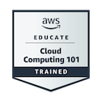

## Hi I am Caleb,👋

- 🎓 

Here are some ideas to get you started:

- 🔭 I’m currently working java terraria clone multiplayer networking using GLFW Libary.
- 🌱 I’m currently learning Cloud service AWS and earning my certifacate studying the exam.
- 💬 Im also learning languages such as C++, Python and C# to pursue Software Devlopment Engineer (SDE)
- 📫 How to reach me: My email is bobdillan201826@gmail.com 

